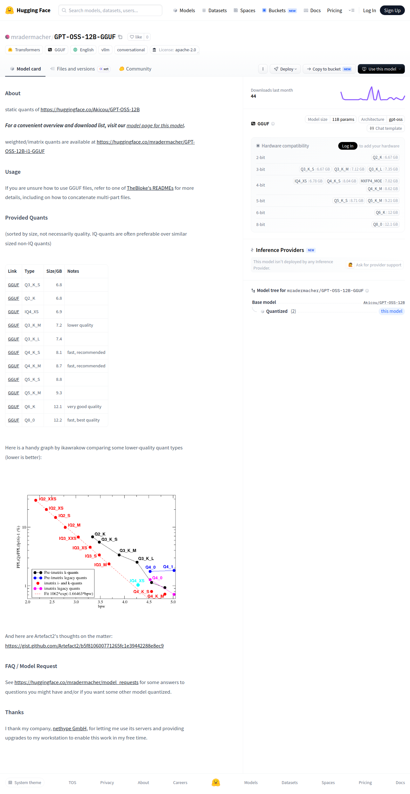

# Visited: https://huggingface.co/mradermacher/GPT-OSS-12B-GGUF?utm_source=chatgpt.com

**Time:** 2026-05-22 09:22:12 UTC

## Favicon

## Screenshot

## Raw HTML
[page.html](./page.html)

## Downloaded Media (4 files)

## Other Links
- [#about](#about)
- [#faq--model-request](#faq--model-request)
- [#provided-quants](#provided-quants)
- [#thanks](#thanks)
- [#usage](#usage)
- [/](/)
- [/Akicou/GPT-OSS-12B](/Akicou/GPT-OSS-12B)
- [/blog](/blog)
- [/chat](/chat)
- [/collections](/collections)
- [/datasets](/datasets)
- [/docs](/docs)
- [/docs/hub/model-cards#specifying-a-base-model](/docs/hub/model-cards#specifying-a-base-model)
- [/enterprise](/enterprise)
- [/front/build/kube-fee5a5c/style.css](/front/build/kube-fee5a5c/style.css)
- [/huggingface](/huggingface)
- [/inference-endpoints](/inference-endpoints)
- [/inference/models](/inference/models)
- [/join](/join)
- [/join/discord](/join/discord)
- [/js/script.js](/js/script.js)
- [/languages](/languages)
- [/learn](/learn)
- [/login](/login)
- [/models](/models)
- [/models?language=en](/models?language=en)
- [/models?library=gguf](/models?library=gguf)
- [/models?library=transformers](/models?library=transformers)
- [/models?other=base_model:quantized:Akicou/GPT-OSS-12B](/models?other=base_model:quantized:Akicou/GPT-OSS-12B)
- [/models?other=conversational](/models?other=conversational)
- [/models?other=vllm](/models?other=vllm)
- [/mradermacher](/mradermacher)
- [/mradermacher/GPT-OSS-12B-GGUF](/mradermacher/GPT-OSS-12B-GGUF)
- [/mradermacher/GPT-OSS-12B-GGUF/colab](/mradermacher/GPT-OSS-12B-GGUF/colab)
- [/mradermacher/GPT-OSS-12B-GGUF/discussions](/mradermacher/GPT-OSS-12B-GGUF/discussions)
- [/mradermacher/GPT-OSS-12B-GGUF/kaggle](/mradermacher/GPT-OSS-12B-GGUF/kaggle)
- [/mradermacher/GPT-OSS-12B-GGUF/tree/main](/mradermacher/GPT-OSS-12B-GGUF/tree/main)
- [/mradermacher/GPT-OSS-12B-GGUF?library=llama-cpp-python](/mradermacher/GPT-OSS-12B-GGUF?library=llama-cpp-python)
- [/mradermacher/GPT-OSS-12B-GGUF?library=transformers](/mradermacher/GPT-OSS-12B-GGUF?library=transformers)
- [/mradermacher/GPT-OSS-12B-GGUF?local-app=docker-model-runner](/mradermacher/GPT-OSS-12B-GGUF?local-app=docker-model-runner)
- [/mradermacher/GPT-OSS-12B-GGUF?local-app=hermes-agent](/mradermacher/GPT-OSS-12B-GGUF?local-app=hermes-agent)
- [/mradermacher/GPT-OSS-12B-GGUF?local-app=lemonade](/mradermacher/GPT-OSS-12B-GGUF?local-app=lemonade)
- [/mradermacher/GPT-OSS-12B-GGUF?local-app=llama.cpp](/mradermacher/GPT-OSS-12B-GGUF?local-app=llama.cpp)
- [/mradermacher/GPT-OSS-12B-GGUF?local-app=ollama](/mradermacher/GPT-OSS-12B-GGUF?local-app=ollama)
- [/mradermacher/GPT-OSS-12B-GGUF?local-app=pi](/mradermacher/GPT-OSS-12B-GGUF?local-app=pi)
- [/mradermacher/GPT-OSS-12B-GGUF?local-app=unsloth](/mradermacher/GPT-OSS-12B-GGUF?local-app=unsloth)
- [/organizations](/organizations)
- [/papers](/papers)
- [/posts](/posts)
- [/pricing](/pricing)

## Stats
- Total links: 93
- Media downloaded: 4
